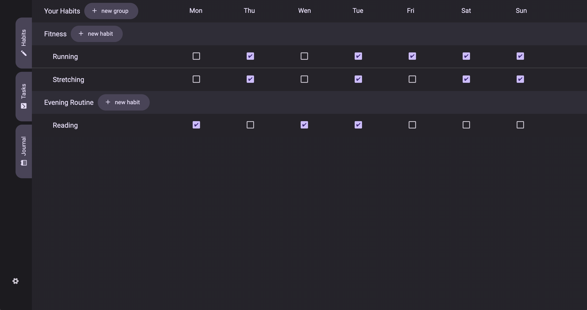
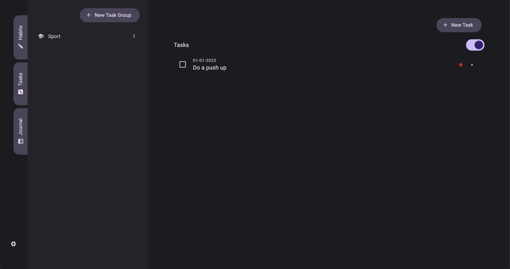
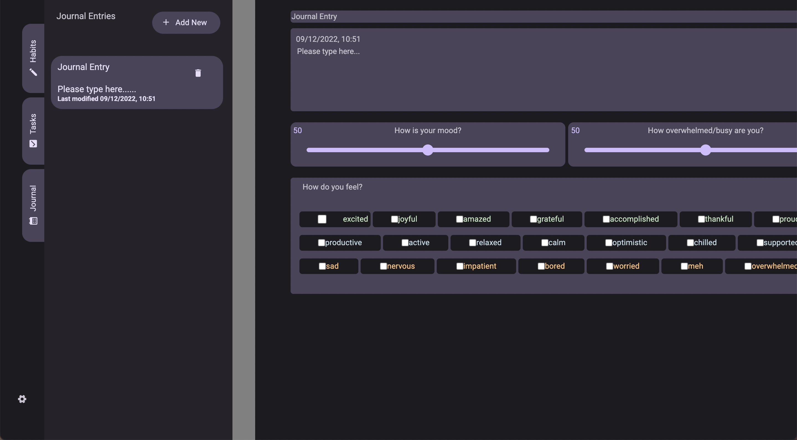
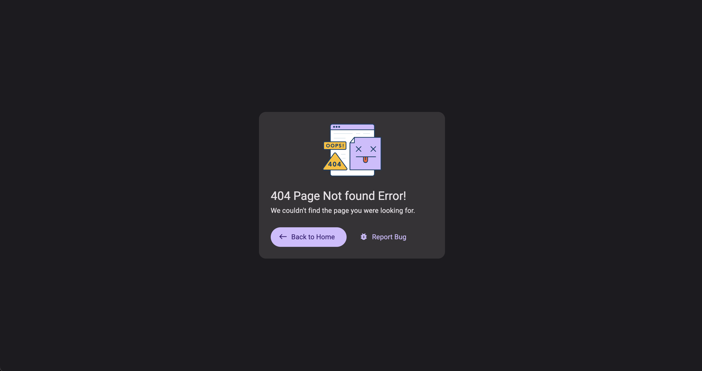

# Habit-Tracker

Habit-Tracker is an application that helps you to keep up with your daily habits.

## Technologies

Project is created with:

- React version: 18.2.0
- bootstrap version: 5.2.2
- firebase version: 9.14.0
- firestore version: 1.1.6

## Setup

To run this project, install it locally using npm:

```
$ cd ../master
$ npm install
$ npm start
```

## Preview

- Habits tab
  
- Tasks tab
  
- Journal tab
  
- Error page
  
